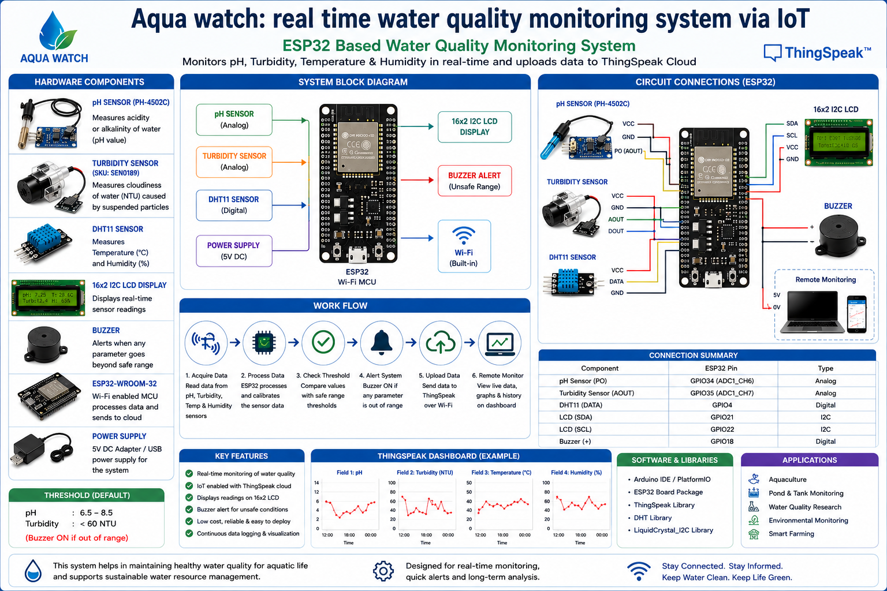
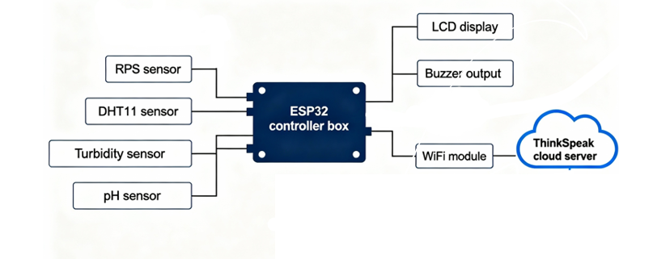
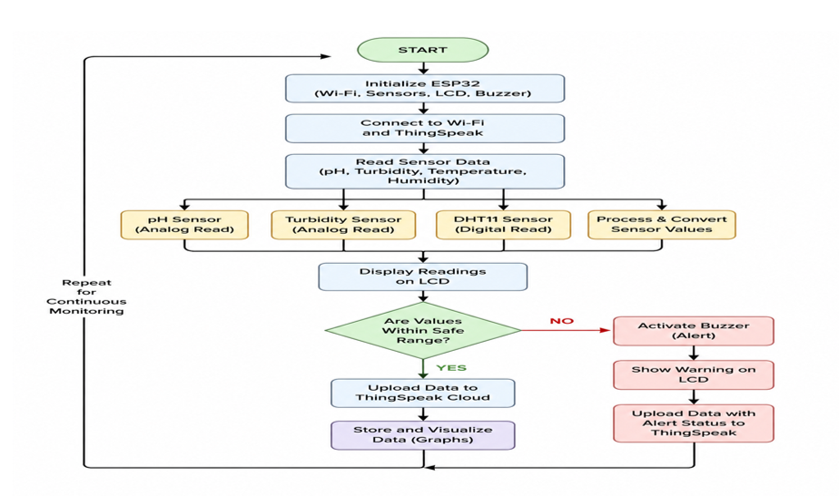

# 🌊 Aqua Watch – Real-Time Water Quality Monitoring System via IoT

## 📌 Overview

**Aqua Watch** is an IoT-based embedded system designed for **real-time water quality monitoring** using an **ESP32 microcontroller**. The system continuously monitors critical water parameters such as **pH, turbidity, temperature, and humidity**, displays the readings on a **16×2 LCD**, uploads the data to the **ThingSpeak cloud platform**, and triggers a **buzzer alert** whenever the water quality exceeds predefined safety thresholds.

This project demonstrates **embedded firmware development, sensor interfacing, IoT cloud connectivity, and real-time environmental monitoring**, making it suitable for **aquaculture, agriculture, environmental protection, and smart water management applications**.

<p align="center">
  
</p>

---

## ⚙️ Key Features

- 🌊 Real-time water quality monitoring
- 📡 Wi-Fi-based IoT connectivity
- ☁️ ThingSpeak cloud integration
- 📟 16×2 I2C LCD display
- 🔔 Buzzer alert for unsafe water conditions
- 📊 Continuous sensor data logging
- 🧩 Modular embedded firmware structure
- ⚡ ESP32-based low-cost embedded system

---

## 🧱 System Architecture

<p align="center">
  
</p>

### Hardware Components

- **ESP32-WROOM-32**
- **pH Sensor**
- **Turbidity Sensor**
- **DHT11 Temperature & Humidity Sensor**
- **16×2 LCD (I2C)**
- **Buzzer**
- **Wi-Fi**
- **ThingSpeak Cloud**

### System Flow

<p align="center">
  
</p>

---

## 🚀 How It Works

1. ESP32 initializes all peripherals and Wi-Fi.
2. pH, turbidity, and DHT11 sensors are read.
3. Sensor values are calibrated and processed.
4. Readings are displayed on the LCD.
5. Threshold conditions are evaluated.
6. The buzzer activates if water quality becomes unsafe.
7. Data is uploaded to ThingSpeak for remote monitoring.
8. The cycle repeats continuously.

---

## 🔌 Hardware Connections

| Component | ESP32 Pin |
|----------|-----------|
| DHT11 | GPIO 4 |
| pH Sensor | GPIO 34 |
| Turbidity Sensor | GPIO 35 |
| Buzzer | GPIO 18 |
| LCD SDA | GPIO 21 |
| LCD SCL | GPIO 22 |

---

## 💻 Firmware Implementation

### Sensor Reading Functions

```cpp
float readPH()
{
    int raw = analogRead(PH_PIN);
    float voltage = raw * (3.3 / 4095.0);
    float ph = 7 + ((2.5 - voltage) / 0.18);
    return ph;
}

float readTurbidity()
{
    int raw = analogRead(TURB_PIN);
    float voltage = raw * (3.3 / 4095.0);

    float ntu = (3.3 - voltage) * 100;

    if(ntu < 0)
        ntu = 0;

    return ntu;
}
```

### LCD Display

```cpp
void updateLCD()
{
    lcd.clear();

    lcd.setCursor(0,0);
    lcd.print("pH:");
    lcd.print(pHValue,1);

    lcd.print(" T:");
    lcd.print(temperature,1);

    lcd.setCursor(0,1);
    lcd.print("Tur:");
    lcd.print(turbidity,1);

    lcd.print(" H:");
    lcd.print(humidity,0);
}
```

### Alert System

```cpp
void checkAlerts()
{
    if(pHValue < PH_LOW ||
       pHValue > PH_HIGH ||
       turbidity > TURBIDITY_LIMIT)
    {
        digitalWrite(BUZZER_PIN, HIGH);
    }
    else
    {
        digitalWrite(BUZZER_PIN, LOW);
    }
}
```

### ThingSpeak Upload

```cpp
void uploadThingSpeak()
{
    ThingSpeak.setField(1, temperature);
    ThingSpeak.setField(2, humidity);
    ThingSpeak.setField(3, pH);
    ThingSpeak.setField(4, turbidity);

    ThingSpeak.writeFields(channelNumber, writeAPIKey);
}
```

---

## 🛠️ Software Requirements

- Arduino IDE / PlatformIO
- ESP32 Board Package
- ThingSpeak Library
- DHT Library
- LiquidCrystal_I2C Library

---

## 📊 Cloud Dashboard

The system uploads:

- pH
- Turbidity
- Temperature
- Humidity

to **ThingSpeak**, enabling:

- Live graphs
- Historical data analysis
- Remote monitoring
- Water quality trend analysis

---

## ⚠️ Limitations

- Sensor calibration is required for accurate readings.
- pH calculation uses a simplified linear conversion.
- Turbidity estimation depends on sensor calibration.
- Wi-Fi availability is required for cloud updates.

---

## 🚀 Future Enhancements

- Dissolved oxygen (DO) sensor integration
- TDS (Total Dissolved Solids) monitoring
- Mobile application support
- SMS/Email alert notifications
- Solar-powered deployment
- Edge-based AI water quality prediction
- Multi-pond monitoring network

---
